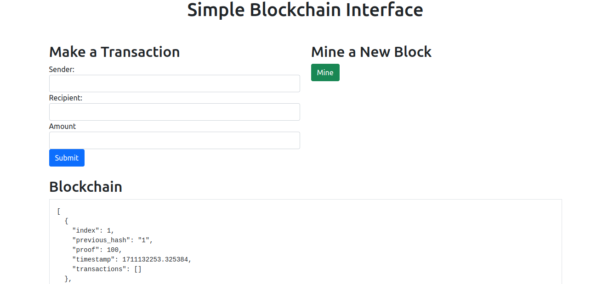
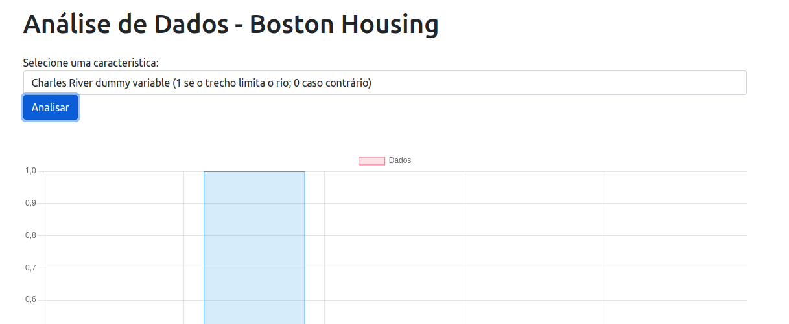
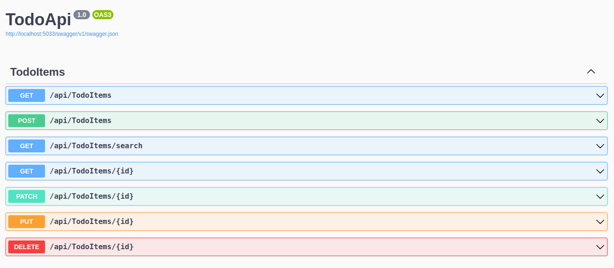

# Backend Projects

Chatbot - chatbot

## Chatbot

### Descrição

Chatbot com Python como servidor e Javascript como Client. Utilizei o nltk para o processamento de linguagem natural.

### Recursos Principais

- Chatbot com servidor e client
- Utilizando Python para o servidor
- Utilizando Javascript para o client
- Utilizando a biblioteca NLTK para o processamento de linguagem natural

Simple Blockchain - simple_blockchain

## Simple Blockchain

### Descrição

Um simples blockchain criado com python e utilizando o javascript na parte da interface. Blockchain simulando uma simples transação, onde tem as rotas para criar uma nova transação, minerar e recuperar o chains. Utilizado o Flask para a parte da API e o Javascript para o frontend em comunicação com a API e o Python para criar o Blockchain.

### Recursos Principais

- Nova Transação
- Minerar
- Novo Bloco
- Recuperar as chains
- Flask para a api
- Javascript no frontend para comunicação com a API
- Blockchain em Python

Simple Analyze Boston Housing - simple_analyze_boston_housing

## Simple Analyze Boston Housing

### Descrição

Criando uma simples análise do csv do HousingData encontrado no Kaggle. Utilizando api do Flask para criar exemplo de simples análises e também criando um filtro para pegar informações do arquivo. Também foi criado gráficos no template com javascript usando o chart.js. Usando o pandas para facilitar nas análises e filtros.

### Recursos Principais

- Filtros dos dados
- Análise de cada dado
- Gráfico em barras com Javascript
- Flask para a api
- Javascript no frontend para comunicação com a API

Todo List With .Net 8 - TodoApi

## Simple Analyze Boston Housing

### Descrição

Criando um todo list com C#/.Net, contendo o Swagger, estrutura de projetos, criando exceções personalizadas.

